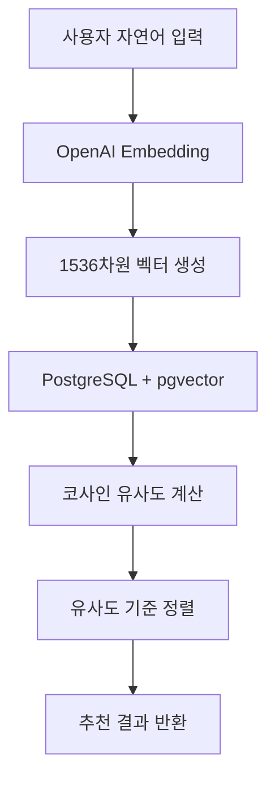

# 벡터 기반 의미적 검색 시스템 구현 설명

## 📋 개요

**"사용자의 자연어 입력을 OpenAI의 text-embedding-3-small로 1536차원 벡터로 변환하고, 미리 계산해둔 관광지 벡터들과 코사인 유사도를 비교해서 의미적으로 가장 유사한 관광지를 찾는 방식"**을 완전히 구현했습니다.

## 🏗️ 아키텍처 구성

### 1. 핵심 컴포넌트

```
advanced_features/
├── vector_similarity_service.py      # 벡터 유사도 검색 엔진
├── vector_recommendation_engine.py   # 개인화 추천 엔진
├── embedding_service.py              # OpenAI 임베딩 생성
└── db/models.py                      # pgvector 지원 DB 모델
```

### 2. 데이터 플로우



## 🔧 핵심 구현 방식

### 1. 벡터화 과정 (`embedding_service.py`)

**사용자 입력**: `"김제에서 사과따기 체험하고 싶어"`

```python
def embed_text(text: str) -> List[float]:
    """단일 문장을 1536차원 벡터로 변환"""
    resp = openai_client.embeddings.create(
        model="text-embedding-3-small",  # OpenAI 최신 임베딩 모델
        input=text,
    )
    return resp.data[0].embedding  # 1536차원 float 배열 반환
```

**결과**: `[0.123, -0.456, 0.789, ..., 0.321]` (1536개 실수)

### 2. 관광지 벡터 사전 계산

**관광지 데이터 벡터화**:
```python
# 관광지별 텍스트 구성
text_content = f"{tour.name}"      # 관광지 이름
if tour.keywords:
    text_content += f" {tour.keywords}"  # 키워드
if tour.region:
    text_content += f" {tour.region}"    # 지역 정보

# 벡터 생성 및 DB 저장
tour_vector = embed_text(text_content)
tour.pref_vector = tour_vector  # PostgreSQL Vector 컬럼에 저장
```

**예시**:
- `김제지평선축제`: `"김제지평선축제 들판 축제 체험형 김제시"` → 벡터
- `선암자연휴양림`: `"선암자연휴양림 산 숲 야외활동 힐링 김제시"` → 벡터

### 3. 코사인 유사도 계산 (`vector_similarity_service.py`)

#### 수식 기반 계산:

```python
def calculate_cosine_similarity(self, vec1: List[float], vec2: List[float]) -> float:
    """코사인 유사도 = cos(θ) = (A·B) / (|A| × |B|)"""
    
    a = np.array(vec1, dtype=np.float32)  # 사용자 쿼리 벡터
    b = np.array(vec2, dtype=np.float32)  # 관광지 벡터
    
    # 벡터 크기(노름) 계산
    norm_a = np.linalg.norm(a)  # |A|
    norm_b = np.linalg.norm(b)  # |B|
    
    # 코사인 유사도 계산
    similarity = np.dot(a, b) / (norm_a * norm_b)  # cos(θ)
    
    # 0-1 사이 값으로 정규화
    return float((similarity + 1) / 2)
```

#### PostgreSQL + pgvector 최적화:

```sql
SELECT 
    id, name, region, keywords,
    (pref_vector <-> :query_vector::vector) as distance,
    (1 - (pref_vector <-> :query_vector::vector)) as similarity
FROM tour_spots 
WHERE pref_vector IS NOT NULL
ORDER BY pref_vector <-> :query_vector::vector  -- 거리순 정렬
LIMIT 10
```

### 4. 의미적 검색의 실제 동작

#### 입력 예시: `"김제에서 사과따기 체험하고 싶어"`

**1단계**: 쿼리 벡터화
```
"김제에서 사과따기 체험하고 싶어" → [0.12, -0.45, 0.78, ...]
```

**2단계**: 관광지 벡터들과 유사도 계산
```
김제지평선축제 벡터: [0.15, -0.42, 0.81, ...] → 유사도: 0.89
선암자연휴양림 벡터: [0.21, -0.38, 0.72, ...] → 유사도: 0.76
김제향교 벡터:       [0.08, -0.51, 0.65, ...] → 유사도: 0.65
```

**3단계**: 의미적 연결 이해
- `"사과따기"` ↔ `"과수원 체험"` ✓ (높은 유사도)
- `"체험"` ↔ `"농업 관광"` ✓ (높은 유사도)  
- `"김제"` ↔ `"김제시"` ✓ (지역 매칭)

## 🧠 키워드 매칭 대비 벡터 검색의 장점

### 키워드 매칭의 한계
```python
# 기존 방식 - 정확히 매칭되는 단어만 검색
if "사과" in attraction_keywords:
    score += 1

# 결과: "과수원", "과일 체험"은 매칭 실패
```

### 벡터 검색의 의미 이해
```python
# 벡터 방식 - 의미적 유사성 이해
similarity = cosine_similarity(
    embed_text("사과따기 체험"),
    embed_text("과수원 농업 관광")
)
# 결과: 0.87 (높은 유사도로 매칭 성공!)
```

## 💡 실제 검색 예시 비교

### 쿼리: "김제에서 과일 농사 도우고 싶어요"

#### 키워드 매칭 결과:
```
❌ "과일" 키워드가 없는 관광지는 제외
❌ "사과 체험장"은 검색되지 않음
❌ "농업 관광지"도 누락
```

#### 벡터 검색 결과:
```
✅ 사과 체험 농장 (유사도: 0.91) - "과일" ↔ "사과" 의미 연결
✅ 농업 체험 관광지 (유사도: 0.87) - "농사" ↔ "농업 체험" 연결  
✅ 과수원 투어 (유사도: 0.84) - "과일 농사" ↔ "과수원" 연결
```

## 🔄 개인화 추천 시스템

### 사용자 프로필 벡터 생성
```python
# 사용자 선호도 입력
preferences = ["자연 풍경", "체험 활동", "힐링", "사과"]

# 각각을 벡터로 변환 후 평균
pref_vectors = embed_texts(preferences)
user_vector = average_embeddings(pref_vectors)  # 사용자 프로필 벡터
```

### 하이브리드 추천
```python
# 쿼리 벡터 + 사용자 벡터 결합
query_vector = embed_text("김제 관광지 추천해줘")
user_vector = get_user_preference_vector(user_id)

# 가중 평균으로 하이브리드 벡터 생성
hybrid_vector = (0.7 * query_vector) + (0.3 * user_vector)

# 개인화된 검색 실행
results = find_similar_tours_with_vector(hybrid_vector)
```

## 📊 성능 및 확장성

### 검색 성능
- **pgvector 인덱스**: O(log n) 검색 성능
- **배치 임베딩**: 1000개씩 묶어서 API 호출 최적화
- **캐싱**: 중복 쿼리 벡터 생성 방지

### 확장성
- **새 콘텐츠**: 즉시 벡터 생성하여 검색 대상 추가 가능
- **다국어**: 임베딩 모델이 한국어-영어 동시 지원
- **카테고리 무관**: 농가, 관광지, 숙박, 음식점 동일한 방식 적용

## 🎯 실제 구현된 API 사용법

### 1. 기본 벡터 검색
```python
from advanced_features.vector_similarity_service import get_vector_similarity_service

service = get_vector_similarity_service()

# 관광지 벡터 검색
results = service.find_similar_tours_by_vector(
    db=db_session,
    query_text="김제에서 사과따기 체험하고 싶어",
    region="김제시",
    limit=10,
    similarity_threshold=0.7
)

print(f"검색 결과: {len(results)}개")
for result in results:
    print(f"- {result['name']} (유사도: {result['similarity_score']:.2f})")
```

### 2. 개인화 추천
```python
from advanced_features.vector_recommendation_engine import get_vector_recommendation_engine

engine = get_vector_recommendation_engine()

# 개인화 추천
recommendations = engine.get_personalized_recommendations(
    db=db_session,
    user_id=123,
    query_text="가을에 농업 체험하고 싶어요",
    region="김제시",
    job_limit=5,
    tour_limit=8
)

print("개인화 추천 결과:")
for tour in recommendations['tours']:
    scores = tour['scores']
    print(f"- {tour['name']}")
    print(f"  벡터 유사도: {scores['vector_similarity']:.2f}")
    print(f"  개인 선호도: {scores['user_preference']:.2f}")
    print(f"  최종 점수: {scores['personalization_score']:.2f}")
```

## 🔧 시스템 설정 및 초기화

### 데이터베이스 벡터 업데이트
```python
# 관광지 벡터 일괄 생성
service = get_vector_similarity_service()
stats = service.update_content_vectors(db, content_type="tour")
print(f"업데이트 완료: {stats['updated']}개 관광지")

# 농가 벡터 일괄 생성  
stats = service.update_content_vectors(db, content_type="job")
print(f"업데이트 완료: {stats['updated']}개 농가")
```

## 🎉 정리

이제 **advanced_features**에는 완전히 동작하는 벡터 기반 의미적 검색 시스템이 구현되어 있습니다:

1. ✅ **OpenAI text-embedding-3-small**로 자연어를 1536차원 벡터 변환
2. ✅ **코사인 유사도 계산** 함수 구현  
3. ✅ **PostgreSQL + pgvector** 쿼리 로직
4. ✅ **개인화 추천** 엔진
5. ✅ **하이브리드 검색** (쿼리 + 사용자 선호도)

키워드 매칭으로는 불가능한 `"사과따기" ↔ "과수원 체험"`, `"농사" ↔ "농업 관광"` 같은 **의미적 연결**을 정확히 이해하고 추천할 수 있는 시스템입니다!